# Arquitectura en la Nube - Proyecto Final

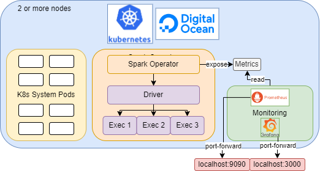

# Video presentación

[](Link)

# Digital Ocean

Es un proveedor de servicios de infraestructura en la nube. Para este proyecto, se creó una cuenta en Digital Ocean y se recibió un crédito de 200 USD. Luego, instalamos el CLI de [Digital Ocean](https://docs.digitalocean.com/reference/doctl/how-to/install/) e instalamos [kubectl](https://kubernetes.io/docs/tasks/tools/).

Para acceder a las funciones de Digital Ocean, debemos [crear](https://cloud.digitalocean.com/account/api/tokens) un token con permisos de escritura y lectura. Luego, inciamos un contexto de Digital Ocean en nuestro local (nos pedirá el token creado) con:
  
```bash
doctl auth init --context <NAME>
doctl auth list
doctl auth switch --context <NAME>
```

Si está bien configurado entonces podemos ver las características de nuestra cuenta con el comando:

```bash
doctl account get
```

Para probar nuestra cuenta, creamos, verificamos y eliminamos un **droplet** con el comando:

```bash
doctl compute droplet create --region sfo2 --image ubuntu-20-04-x64 --size s-1vcpu-1gb dropletTest
doctl compute droplet list
doctl compute droplet delete <DROPLET-ID>
```

Un droplet es el equivalente a una máquina virtual donde se instalarán las aplicaciones de Digital Ocean. Para un clúster de Kubernetes, cada nodo correspondería a un droplet. Por este motivo, es importante comprobar que podemos crear y eliminar droplets.

# Digital Ocean Container Registry

Es un servicio de Digital Ocean que permite alojar imágenes Docker, y así las podemos usar en nuestros clústeres de Kubernetes. Para crear un registro, usamos el comando:

```bash
doctl registry create docrjneirar
```

Luego, lo registramos de forma local para que nuestros comandos de Docker apunten a este registro con el comando:

```bash
doctl registry login
```

Luego, creamos y subimos la imagen de nuestra aplicación con los comandos:

```bash
docker build --no-cache -t training-dt-100 .
docker tag training-dt-01 registry.digitalocean.com/docrjneirar/training-dt-100
docker push registry.digitalocean.com/docrjneirar/training-dt-100
```

Para esta imagen, se incluyó la data de entrenamiento en la misma imagen, sin embargo, si la data estuviera en algún lugar en la nube, debemos hacer la configuración necesaria para que el clúster pueda acceder a ella.

# Digital Ocean Kubernetes

Para crear un clúster de Kubernetes, primero debemos definir las características de los nodos. Con el siguiente comando vemos las opciones disponibles:

```bash
doctl kubernetes options sizes
```

Una vez definido el tamaño de los nodos, creamos el clúster con el comando:

```bash
doctl kubernetes cluster create kube --tag kube --auto-upgrade=true --node-pool "name=poolkube;size=s-2vcpu-4gb;count=2;auto-scale=true;min-nodes=2;max-nodes=10;tag=nodepoolkube"
```

Donde **kube** es el nombre del clúster, **poolkube** es el nombre del conjunto de nodos del clúster,**s-2vcpu-4gb** es el tamaño del nodo de 2 CPU y 4 GB de memoria. Además, se definen las características del conjunto de nodos como el auto-escalado, el mínimo y máximo de nodos, y el tag que se le asignará a los nodos.

Cuando el clúster inicia, podemos ver a los dos nodos creados. Y cuando la aplicación requiere de más recursos, se crean nodos automáticamente hasta un máximo de 10 como se definió en el comando anterior. En la [imagen](images/cloud/node2.png) se muestra el clúster creado y en la [imagen](images/cloud/node2plus.png) se muestra el clúster con una aplicación que requiere de más recursos.

# Acceso al DOCR

Para acceder al registro de imágenes de Digital Ocean, primero debemos definirlo en el clúster y darle acceso con service account con los comandos:

```bash
doctl registry kubernetes-manifest | kubectl apply -f -
kubectl patch serviceaccount default -p '{\"imagePullSecrets\": [{\"name\": \"registry-docrjneirar\"}]}'
```

Luego descargamos el json con las credenciales del registro y creamos un secret para que el clúster pueda acceder al registro con los comandos:

```bash
kubectl create secret generic regcred --from-file=.dockerconfigjson=docker-config.json --type=kubernetes.io/dockerconfigjson
```

# Spark Operator

Es una herramienta que facilita la ejecución y gestión de aplicaciones Apache Spark en Kubernetes. Para instalarlo, usamos el gestor de paquetes choco (en Windows) y Helm (gestor de paquetes para Kubernetes).

```bash
choco install kubernetes-helm
helm repo add spark-operator https://googlecloudplatform.github.io/spark-on-k8s-operator
helm install spark-operator-release spark-operator/spark-operator --namespace spark-operator --set webhook.enable=true
```

Para ejecutar aplicaciones de Spark, debemos otorgar permisos, para lo cual creamos un service account con el comando.

```bash
kubectl create serviceaccount spark -n default
```

Y con el archivo [spark-permission.yaml](spark-permission.yaml) creamos un cluster role binding para el service account.

```yaml
apiVersion: rbac.authorization.k8s.io/v1
kind: ClusterRoleBinding
metadata:
  name: spark-role-binding
subjects:
- kind: ServiceAccount
  name: spark
  namespace: default
roleRef:
  kind: ClusterRole
  name: edit
  apiGroup: rbac.authorization.k8s.io
```

```bash
kubectl apply -f spark-permission.yaml
```

Luego, podremos usar SparkApplication en un archivo yaml. Las operaciones que podemos realizar son:

```bash
kubectl get sparkapplications
kubectl apply -f spark-training-dt-100.yaml
kubectl describe sparkapplication training-dt-100
kubectl logs training-dt-100-driver
kubectl delete sparkapplication training-dt-100
```

# Monitoreo con Prometheus y Grafana

Instalamos Prometheus y Grafana con Helm.

```bash
helm repo add prometheus-community https://prometheus-community.github.io/helm-charts
helm repo update
helm install prometheus prometheus-community/prometheus --namespace monitoring --create-namespace

helm repo add grafana https://grafana.github.io/helm-charts
helm repo update
helm install grafana grafana/grafana --namespace monitoring --create-namespace
```

Para acceder a Prometheus y Grafana, redireccionamos sus puertos con los comandos:

```bash
kubectl port-forward svc/prometheus-server -n monitoring 9090:80
kubectl port-forward svc/grafana -n monitoring 3000:80
```

Luego, abrimos http://localhost:9090 y http://localhost:3000 en el navegador. En el caso de Grafana, el usuario y contraseña por defecto son admin/admin, si la contraseña es incorrecta, podemos obtenerla con el comando:
  
```bash 
kubectl get secret --namespace monitoring grafana -o jsonpath="{.data.admin-password}" | ForEach-Object { [System.Text.Encoding]::UTF8.GetString([System.Convert]::FromBase64String($_)) }
```

## Exportar métricas de Spark

Para exponer métricas de Spark usamos el objeto PrometheusServlet. Para configurar las métricas, usamos un archivo [metrics.properties](metrics.properties) y lo montamos en un configmap con el comando:

```bash
kubectl create configmap spark-metrics-config --from-file=metrics.properties
kubectl port-forward svc/training-dt-100-ui-svc 4040:4040
```

Verificamos las métricas expuestas en 
- http://localhost:4040/metrics/executors/prometheus
- http://localhost:4040/metrics/prometheus/

## Capturar métricas de Spark con Prometheus

Buscamos el configmap de Prometheus y lo editamos.

```bash
kubectl get configmaps -n monitoring
kubectl edit configmap prometheus-server -n monitoring
```

En la sección de scrape_configs, agregamos lo siguiente:

```yaml
[...]
scrape_configs:
[...] (otros jobs)
- job_name: spark
  metrics_path: '/metrics/prometheus/'
  static_configs:
  - targets: ['training-dt-100-ui-svc.default:4040']
- job_name: spark-exec
  metrics_path: '/metrics/executors/prometheus/'
  static_configs:
  - targets: ['training-dt-100-ui-svc.default:4040']
```

Identificar el pod de prometheus server y reiniciamos el servicio con el siguiente comando (cambiar con el nombre del pod correspondiente):
  
```bash
kubectl delete pod prometheus-server-<id> -n monitoring
```

Luego, redireccionamos el puerto, abrimos http://localhost:9090 y verificamos en Status/Targets que ambos jobs de Spark estén en estado UP. Esto solo se verá cuando hay una aplicación de Spark ejecutándose, luego podemos ejecutar los queries

Para configurar Grafana debemos añadir un datasource Prometheus en Connections, usamos el URL http://prometheus-server:80 (verificar puerto en los servicios de Prometheus), testeamos y guardamos. Si la conexión es exitosa, el siguiente paso es crear el dashboard para ver las métricas que sean relevantes para nuestro estudio.

Entre las métricas más importantes se encuentran:

- Porcentaje de Tareas Completadas

```bash
(sum by(executor_id) (increase(metrics_executor_completedTasks_total{executor_id!="driver"}[5m]))) / (sum by(executor_id) (metrics_executor_totalTasks_total{executor_id!="driver"}))
```

- Uso de CPU por Pod

```bash 
sum(rate(container_cpu_usage_seconds_total{namespace="default"}[5m])) by (pod)
```

- Memory Usage by Pod

```bash
sum(container_memory_usage_bytes{namespace="default"}) by (pod)
```

- Uso de Memoria del Heap de JVM del Driver

```bash 
avg_over_time({__name__=~"metrics_spark_.*_driver_jvm_heap_used_Value", type="gauges"}[1m])
```

- Uso Total de Memoria Heap JVM por Ejecutor

```bash 
sum by(executor_id) (metrics_executor_JVMHeapMemory_bytes)
```

- Memoria Heap para Almacenamiento en Ejecutores

```bash
sum by(executor_id) (metrics_executor_usedOnHeapStorageMemory_bytes) 
```

- Balance de Carga de Tareas en Ejecutores

```bash
sum by (executor_id) (increase(metrics_executor_completedTasks_total[5m]))
```

- Tiempo total de Garbage Collection

```bash
sum by(executor_id) (metrics_executor_totalGCTime_seconds_total)
```

- Duración Total de Tareas por Ejecutor en Spark

```bash
sum by(executor_id) (metrics_executor_totalDuration_seconds_total)
```

- Total de Tareas por Ejecutor en Spark

```bash
sum by(executor_id) (metrics_executor_totalTasks_total)
```

- Porcentaje de Tiempo en GC vs Tiempo Total de Ejecución por Ejecutor en Spark

```bash
(sum by(executor_id) (metrics_executor_totalGCTime_seconds_total) / sum by(executor_id) (metrics_executor_totalDuration_seconds_total)) * 100
```

- Porcentaje de Memoria RAM Utilizada por Spark
  
```bash
(
  sum(metrics_executor_JVMHeapMemory_bytes + metrics_executor_JVMOffHeapMemory_bytes)
  /
  sum(machine_memory_bytes)
) 
```

- Porcentaje de CPU Utilizado por Spark
  
```bash
(
  sum(rate(container_cpu_usage_seconds_total{namespace="default",pod=~"spark.*"}[5m]))
  /
  sum(machine_cpu_cores)
)
```

Y nuestro dashboard final es:

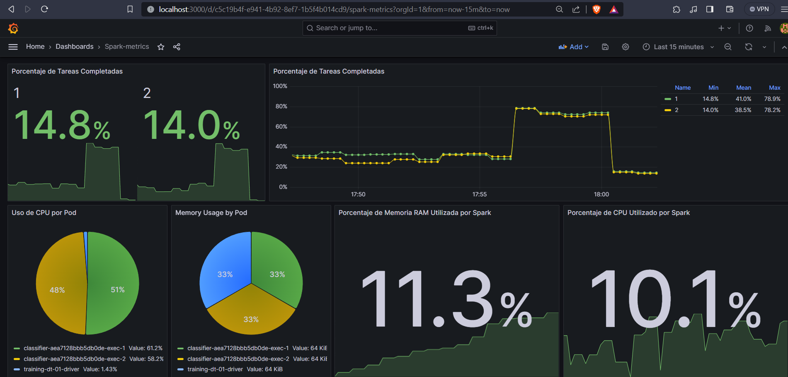

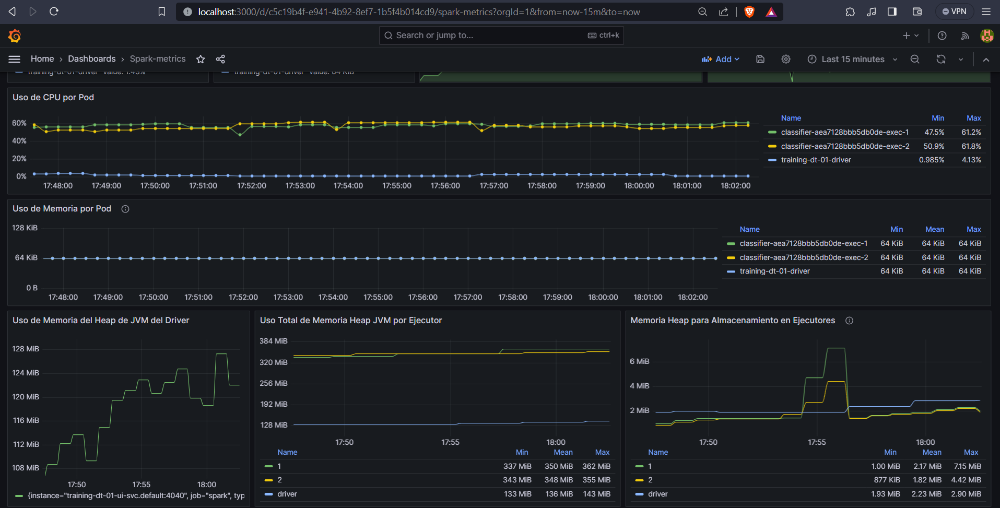

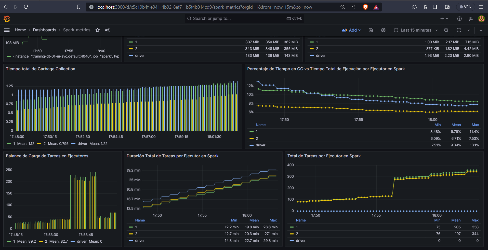

Como este Dashboard se implementó en el clúster local de Minikube, podemos exportar su configuración en un json y lo importamos en nuestro clúster de Digital Ocean.

# Pruebas

## Ejecución del entrenamiento con data01

Al ejecutar la aplicación con solo el 1% de la data, observamos una diferencia con Minikube, en este caso los tiempos son menores debido a que cada nodo del clúster es independiente y solo es utilizado para esta aplicación. Solo se probó con 1 y 10 ejecutores debido a que el tiempo es muy bajo. En el caso de 10 ejecutores, el clúster debía crear más nodos, sin embargo, al ser la aplicación muy pequeña, se creaban pero no se usaban. Los resultados se encuentran en la carpeta [cloud](results/cloud/) y se resumen en la siguiente tabla:

| | Tiempo de Entrenamiento | Tiempo Total | Accuracy | Precision | Recall | F1 Score |
|-|-------------------------|--------------|----------|-----------|--------|----------|
| 1 ejecutor| 33 seg                  | 110 seg           | 0.71     | 0.69      | 0.71   | 0.66     |
| 10 ejecutores| 35 seg                  | 148 seg           | 0.71     | 0.69      | 0.71   | 0.66     |

## Ejecución del entrenamiento con data100

Ahora ejecutamos la aplicación con el 100% de la data. Se probó la aplicación con 1, 2, ..., 10 ejecutores. Los resultados se encuentran en la carpeta [cloud](results/cloud/) y se resumen en la siguiente tabla:

| | Tiempo de Entrenamiento | Tiempo Total | Accuracy | Precision | Recall | F1 Score |
|-|-------------------------|--------------|----------|-----------|--------|----------|
| 1 ejecutor| 5.4 min                  | 11.56 min           | 0.65     | 0.67      | 0.65   | 0.61     |
| 2 ejecutores| 3.8 min                  | 8.8 min           | 0.65     | 0.67      | 0.65   | 0.61     |
| 3 ejecutores| 3.7 min                  | 7.59 min           | 0.65     | 0.67      | 0.65   | 0.61     |
| 4 ejecutores| 2.52 min                  | 6.11 min           | 0.67     | 0.67      | 0.67   | 0.63     |
| 5 ejecutores| 2.95 min                  | 6.16 min           | 0.65     | 0.67      | 0.65   | 0.62     |
| 6 ejecutores| 1.78 min                  | 4.58 min           | 0.68     | 0.66      | 0.68   | 0.64     |
| 7 ejecutores| 2.05 min                  | 4.78 min           | 0.68     | 0.66      | 0.68   | 0.64     |
| 8 ejecutores| 1.64 min                  | 4.29 min           | 0.65     | 0.67      | 0.65   | 0.61     |
| 9 ejecutores| 1.52 min                  | 4.16 min           | 0.65     | 0.68      | 0.65   | 0.61     |
| 10 ejecutores| 1.32 min                  | 3.93 min           | 0.65     | 0.68      | 0.65   | 0.61     |

Se observa que los tiempos disminuyen conforme se incrementan los ejecutores, sin embargo debemos tener en cuenta que un mayor requerimiento de ejecutores requiere de más nodos, y por lo tanto, un mayor costo. Además, la creación de nodos también toma un tiempo, por lo que las tareas Spark se ejecutan en un inicio con los nodos disponibles, y luego se distribuyen equitatívamente entre los nuevos nodos. Por este motivo, debemos encontrar un balance entre el tiempo de ejecución y el costo.

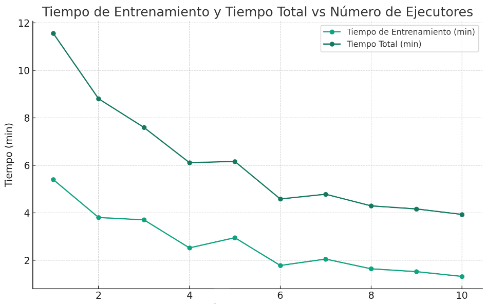

## Consumo de memoria y CPU en aplicaciones Spark

Al ejecutar la aplicación con distinta cantidad de ejecutores, el dashboard de Grafana nos muestra el comportamiento de la memoria y CPU de los nodos. En las siguientes imágenes se muestra el dashboard para 1, 2 y 3 ejecutores.

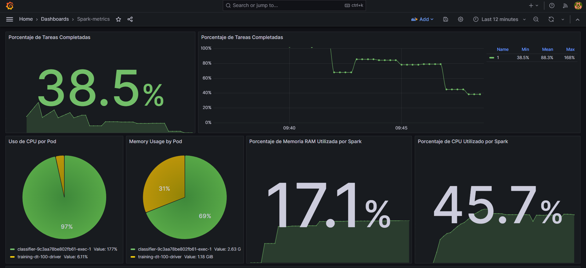

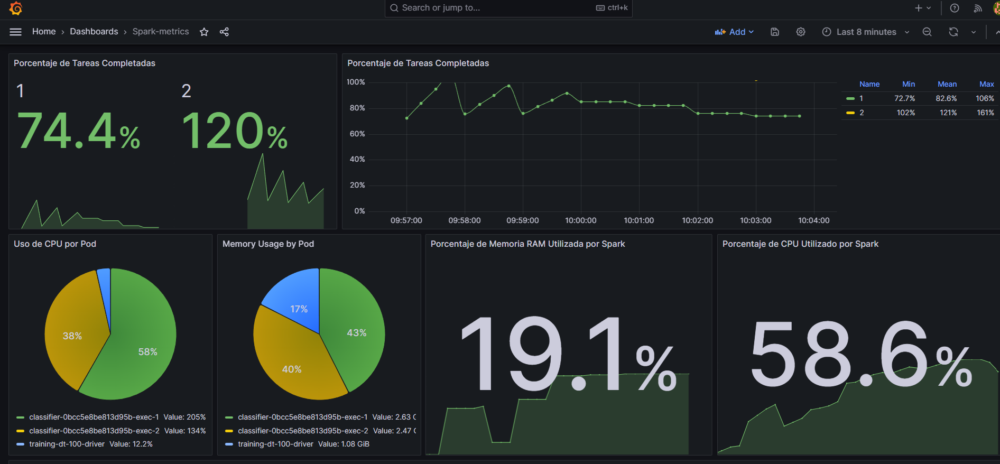

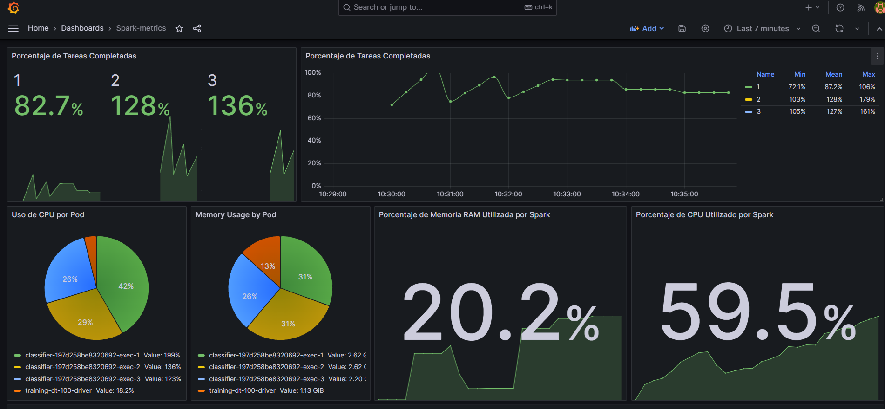

En estas imágenes se observa que el porcentaje de tareas completadas baja en el tiempo debido a que se crean nuevas tareas conforme pasa el tiempo, y esta métrica promedia la cantidad de tareas hechas en un porcentaje de tiempo. Respecto a la asignación de CPU y memoria por ejecutor, Spark asigna los recursos de forma equitativa, incluso si el ejecutor es creado en un nodo nuevo en un momento posterior al inicio de la ejecución.

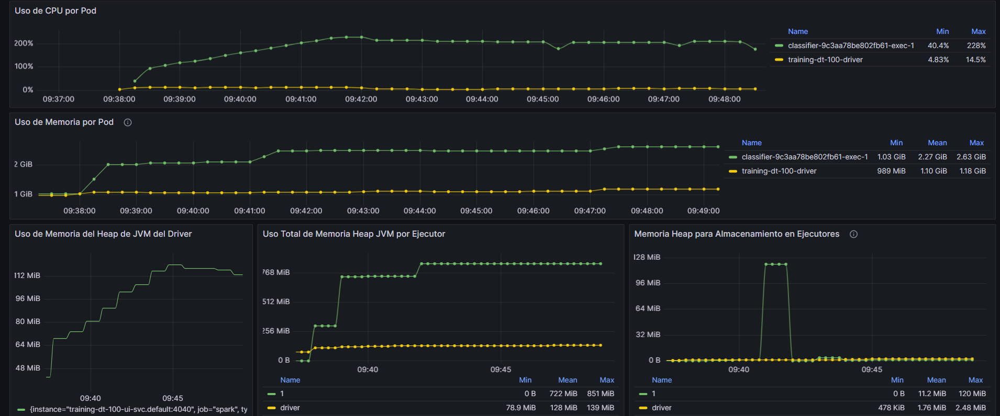

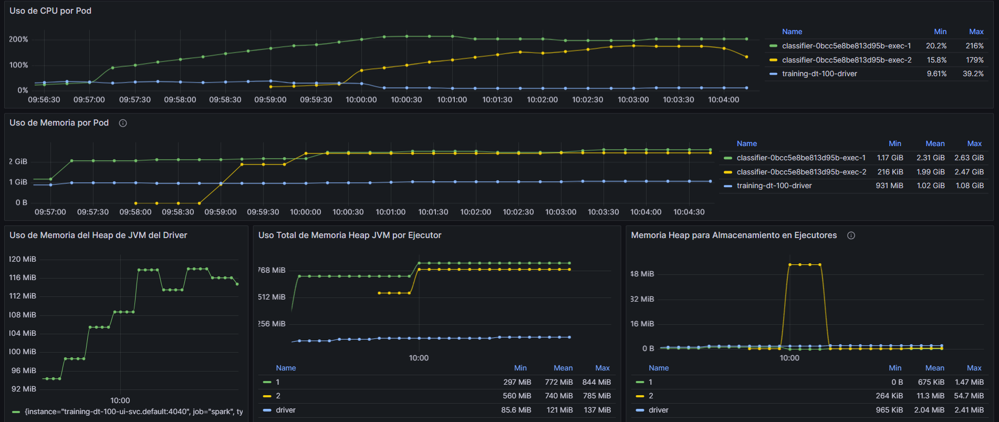

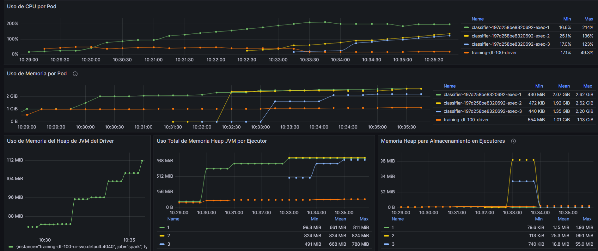

Observamos la asignación equitativa de recursos en los nodos conforme el tiempo avanza. La memoria del driver incrementará hasta que las tareas hayan sido repartidas. En el caso de la memoria de los ejecutores, se observa que aumenta hasta que se estabiliza, y la memoria Heap solo se usa cuando es necesario.

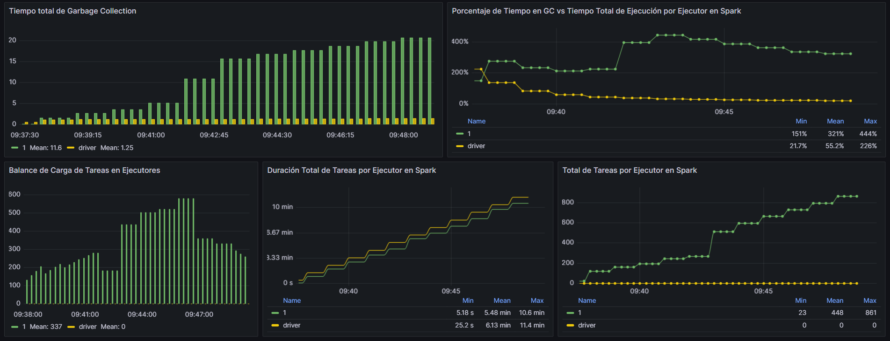

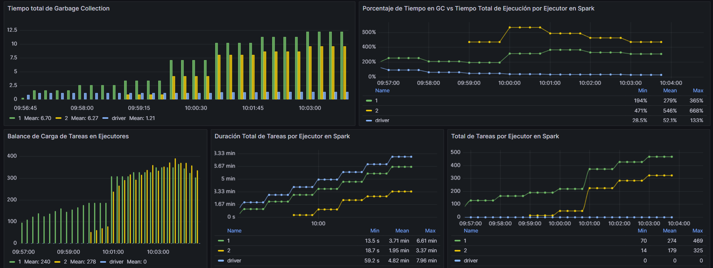

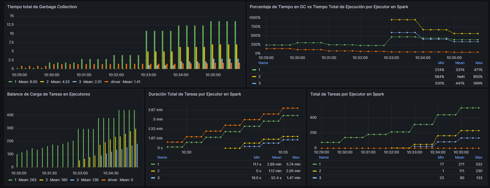

En estas últimas imágenes, se observa la administración de la memoria en los nodos. El tiempo de Garbage Collection es el que se usa para eliminar la data de la memoria que ya no se usará más. Como se ve, Spark realiza esta operación de tal forma que evita fugas de memoria. Por último, las tareas se envían a los ejecutores disponibles de forma equitativa.

# Conclusiones

- La implementación de un clúster de Kubernetes nos permite administrar de forma más eficiente los recursos que nuestras aplicaciones requieren. Además, se pueden realizar automatizaciones que nos permitan escalar los recursos de forma automática, y nos facilita el despliegue de aplicaciones, sobretodo si se desarrollan bajo un enfoque de microservicios.

- El uso de Digital Ocean nos permite administrar recursos en la nube de forma sencilla. Creamos un clúster de Kubernetes de forma rápida, así como un registro de imágenes Docker.

- Spark Operator es una herramienta que nos permite ejecutar aplicaciones de Spark en Kubernetes de forma sencilla. Además, nos permite exponer las métricas para que aplicaciones como Prometheus y Grafana puedan monitorearlas a través de consultas y dashboards personalizados.

- Prometheus y Grafana son herramientas de monitoreo que se complementan muy bien. Prometheus nos permite capturar métricas de aplicaciones como Spark, y Grafana nos permite crear dashboards personalizados para visualizar las métricas que sean relevantes para nuestro estudio.
