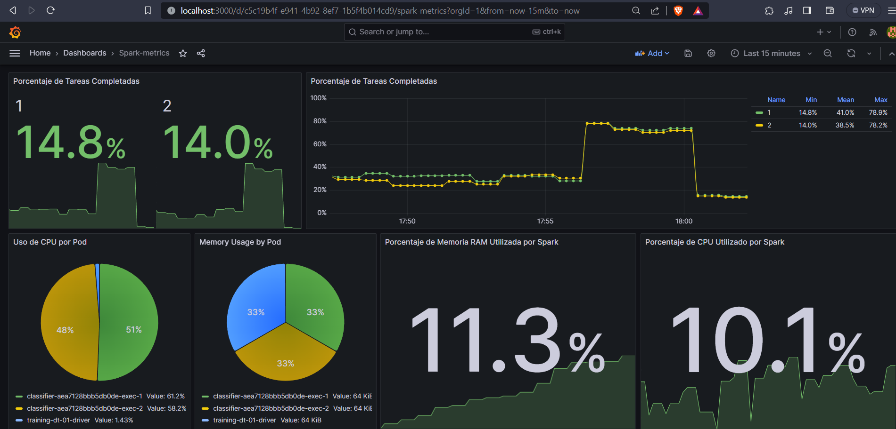
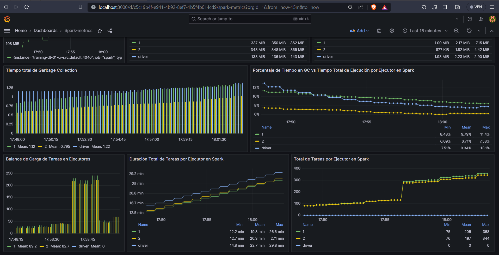

# Arquitectura local


# Video presentación

[https://youtu.be/yUM5FmQyuu4](https://youtu.be/yUM5FmQyuu4)

# Instalación de minikube

Instalamos Minkube para Windows, y luego lo iniciamos con el siguiente comando:

```bash
minikube start
```

Minikube se iniciará con el driver de Docker, por lo que debemos asegurarnos que Docker Desktop esté corriendo. Luego, verificamos que el cluster esté corriendo con el comando:
  
```bash 
kubectl get pods --all-namespaces
```

Veremos los pods del cluster corriendo. Iniciamos el dashboard con el comando:

```bash
minikube dashboard
```

Esto abrirá el dashboard en el navegador. Aquí podemos ver los pods, servicios, deployments, etc. del cluster. También podemos ver los logs de los pods, ejecutar comandos en los pods, etc.

Para detener el cluster, usamos el comando:

```bash
minikube stop
```

# Datos

Para este proyecto, usaremos el dataset de [ZTE_TAD](https://www.kaggle.com/datasets/camellia2013/zte-tad-dataset) de Kaggle, el cual contiene información de paquetes de red capturados en aplicaciones del mercado chino. Los clasificamos por categoría y generamos archivos parquet. Los archivos y carpetas se ubican de forma local en D:/data01. Para que el cluster pueda acceder a estos archivos, debemos crear un volumen con el archivo de configuración [pv01.yaml](pv01.yaml) y montarlo en el cluster con los comando:

```bash
kubectl apply -f pv01.yaml
minikube mount D:/data01:/data01
```

# Spark Operator

Es una herramienta que facilita la ejecución y gestión de aplicaciones Apache Spark en Kubernetes. Para instalarlo, usamos el gestor de paquetes choco (en Windows) y Helm (gestor de paquetes para Kubernetes).

```bash
choco install kubernetes-helm
helm repo add spark-operator https://googlecloudplatform.github.io/spark-on-k8s-operator
helm install spark-operator-release spark-operator/spark-operator --namespace spark-operator --set webhook.enable=true
```

Para ejecutar aplicaciones de Spark, debemos otorgar permisos, para lo cual creamos un service account con el comando.

```bash
kubectl create serviceaccount spark -n default
```

Y con el archivo [spark-permission.yaml](spark-permission.yaml) creamos un cluster role binding para el service account.

```yaml
apiVersion: rbac.authorization.k8s.io/v1
kind: ClusterRoleBinding
metadata:
  name: spark-role-binding
subjects:
- kind: ServiceAccount
  name: spark
  namespace: default
roleRef:
  kind: ClusterRole
  name: edit
  apiGroup: rbac.authorization.k8s.io
```

```bash
kubectl apply -f spark-permission.yaml
```

Luego, podremos usar SparkApplication en un archivo yaml. Las operaciones que podemos realizar son:

```bash
kubectl get sparkapplications
kubectl apply -f spark-training-dt-01.yaml
kubectl describe sparkapplication training-dt-01
kubectl logs training-dt-01-driver
kubectl delete sparkapplication training-dt-01
```

# Docker
Para crear una imagen directamente en Kubernetes, debemos configurar el contexto de Docker para que apunte a Minikube. Para ello, usamos el siguiente comando:

```bash
& minikube -p minikube docker-env --shell powershell | Invoke-Expression
docker build --no-cache -t training-dt-01 .
```

Las imágenes que se creen con este contexto se guardarán en el registro de Minikube. Para ver y borrar las imágenes, usamos el comando:

```bash
docker images
docker rmi <image_id>
```

# Monitoreo con Prometheus y Grafana

Instalamos Prometheus y Grafana con Helm.

```bash
helm repo add prometheus-community https://prometheus-community.github.io/helm-charts
helm repo update
helm install prometheus prometheus-community/prometheus --namespace monitoring --create-namespace

helm repo add grafana https://grafana.github.io/helm-charts
helm repo update
helm install grafana grafana/grafana --namespace monitoring --create-namespace
```

Para acceder a Prometheus y Grafana, redireccionamos sus puertos con los comandos:

```bash
kubectl port-forward svc/prometheus-server -n monitoring 9090:80
kubectl port-forward svc/grafana -n monitoring 3000:80
```

Luego, abrimos http://localhost:9090 y http://localhost:3000 en el navegador. En el caso de Grafana, el usuario y contraseña por defecto son admin/admin, si la contraseña es incorrecta, podemos obtenerla con el comando:
  
```bash 
kubectl get secret --namespace monitoring grafana -o jsonpath="{.data.admin-password}" | ForEach-Object { [System.Text.Encoding]::UTF8.GetString([System.Convert]::FromBase64String($_)) }
```

## Exportar métricas de Spark

Para exponer métricas de Spark usamos el objeto PrometheusServlet. Para configurar las métricas, usamos un archivo [metrics.properties](metrics.properties) y lo montamos en un configmap con el comando:

```bash
kubectl create configmap spark-metrics-config --from-file=metrics.properties
kubectl port-forward svc/training-dt-01-ui-svc 4040:4040
```

Verificamos las métricas expuestas en 
- http://localhost:4040/metrics/executors/prometheus
- http://localhost:4040/metrics/prometheus/

## Capturar métricas de Spark con Prometheus

Buscamos el configmap de Prometheus y lo editamos.

```bash
kubectl get configmaps -n monitoring
kubectl edit configmap prometheus-server -n monitoring
```

En la sección de scrape_configs, agregamos lo siguiente:

```yaml
[...]
scrape_configs:
[...] (otros jobs)
- job_name: spark
  metrics_path: '/metrics/prometheus/'
  static_configs:
  - targets: ['training-dt-01-ui-svc.default:4040']
- job_name: spark-exec
  metrics_path: '/metrics/executors/prometheus/'
  static_configs:
  - targets: ['training-dt-01-ui-svc.default:4040']
```

Identificar el pod de prometheus server y reiniciamos el servicio con el siguiente comando (cambiar con el nombre del pod correspondiente):
  
```bash
kubectl delete pod prometheus-server-7bbd49dd-6m6lm -n monitoring
```

Luego, redireccionamos el puerto, abrimos http://localhost:9090 y verificamos en Status/Targets que ambos jobs de Spark estén en estado UP. Esto solo se verá cuando hay una aplicación de Spark ejecutándose, luego podemos ejecutar los queries

Para configurar Grafana debemos añadir un datasource Prometheus en Connections, usamos el URL http://prometheus-server:80 (verificar puerto en los servicios de Prometheus), testeamos y guardamos. Si la conexión es exitosa, el siguiente paso es crear el dashboard para ver las métricas que sean relevantes para nuestro estudio.

Entre las métricas más importantes se encuentran:

- Porcentaje de Tareas Completadas

```bash
(sum by(executor_id) (increase(metrics_executor_completedTasks_total{executor_id!="driver"}[5m]))) / (sum by(executor_id) (metrics_executor_totalTasks_total{executor_id!="driver"}))
```

- Uso de CPU por Pod

```bash 
sum(rate(container_cpu_usage_seconds_total{namespace="default"}[5m])) by (pod)
```

- Memory Usage by Pod

```bash
sum(container_memory_usage_bytes{namespace="default"}) by (pod)
```

- Uso de Memoria del Heap de JVM del Driver

```bash 
avg_over_time({__name__=~"metrics_spark_.*_driver_jvm_heap_used_Value", type="gauges"}[1m])
```

- Uso Total de Memoria Heap JVM por Ejecutor

```bash 
sum by(executor_id) (metrics_executor_JVMHeapMemory_bytes)
```

- Memoria Heap para Almacenamiento en Ejecutores

```bash
sum by(executor_id) (metrics_executor_usedOnHeapStorageMemory_bytes) 
```

- Balance de Carga de Tareas en Ejecutores

```bash
sum by (executor_id) (increase(metrics_executor_completedTasks_total[5m]))
```

- Tiempo total de Garbage Collection

```bash
sum by(executor_id) (metrics_executor_totalGCTime_seconds_total)
```

- Duración Total de Tareas por Ejecutor en Spark

```bash
sum by(executor_id) (metrics_executor_totalDuration_seconds_total)
```

- Total de Tareas por Ejecutor en Spark

```bash
sum by(executor_id) (metrics_executor_totalTasks_total)
```

- Porcentaje de Tiempo en GC vs Tiempo Total de Ejecución por Ejecutor en Spark

```bash
(sum by(executor_id) (metrics_executor_totalGCTime_seconds_total) / sum by(executor_id) (metrics_executor_totalDuration_seconds_total)) * 100
```

- Porcentaje de Memoria RAM Utilizada por Spark
  
```bash
(
  sum(metrics_executor_JVMHeapMemory_bytes + metrics_executor_JVMOffHeapMemory_bytes)
  /
  sum(machine_memory_bytes)
) 
```

- Porcentaje de CPU Utilizado por Spark
  
```bash
(
  sum(rate(container_cpu_usage_seconds_total{namespace="default",pod=~"spark.*"}[5m]))
  /
  sum(machine_cpu_cores)
)
```

Y nuestro dashboard final es:






Entre las pruebas realizadas, se testeó el entrenamiento con 1, 2, 3 y 4 ejecutores. Los resultados se encuentran en la carpeta [results](results/) y se resumen en la siguiente tabla:

| | Tiempo de Entrenamiento | Tiempo Total | Accuracy | Precision | Recall | F1 Score |
|-|-------------------------|--------------|----------|-----------|--------|----------|
| 1 ejecutor| 23.1 min                  | 1h 13min           | 0.71     | 0.69      | 0.71   | 0.66     |
| 2 ejecutores| 12.6 min                  | 39 min           | 0.71     | 0.69      | 0.71   | 0.66     |
| 3 ejecutores| 14.2 min                  | 42.6 min           | 0.69     | 0.72      | 0.69   | 0.66     |
| 4 ejecutores| 12.3 min                  | 39.7 min           | 0.70     | 0.72      | 0.70   | 0.66     |
| 5 ejecutores| 11.4 min                  | 33.7 min           | 0.71     | 0.69      | 0.71   | 0.66     |
| 6 ejecutores| 9.8 min                  | 29.2 min           | 0.71     | 0.69      | 0.71   | 0.66     |
| 7 ejecutores| 8.63 min                  | 25.8 min           | 0.71     | 0.69      | 0.71   | 0.66     | 

Se observa una mejora en el tiempo de ejecución debido a la distribución de las tareas entre los ejecutores de Spark, lo cual demuestra la escalabilidad horizontal del problema. Además, usamos las herramientas que nos ofrece el monitoreo de Kubernetes para hacer seguimiento a las métricas más importantes.

