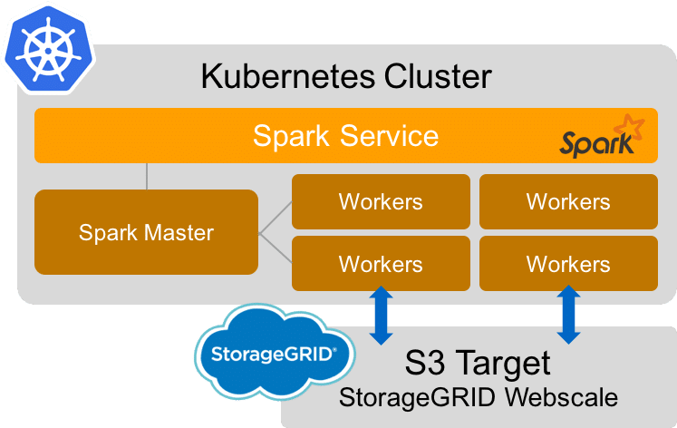

# Proyecto de Cloud Computing

## Integrante
- Neira, Jorge

## Descripción

El proyecto consiste en utilizar herramientas de Cloud Computing para levantar una aplicación de Machine Learning que permita clasificar la información obtenida de los paquetes de red capturados en la base de datos [ZTE_TAD](https://www.kaggle.com/datasets/camellia2013/zte-tad-dataset) de Kaggle. Para cumplir este objetivo utilizaremos las siguientes herramientas:

- Base de datos, para almacenar toda la información obtenida de los paquetes de red y los modelos entrenados.

- SparkML, como herramienta de Machine Learning para entrenar los modelos de clasificación con una gran cantidad de datos.

- Kubernetes, para levantar la aplicación en un ambiente de contenedores y poder escalarla de manera horizontal. En este ambiente se configurará Hadoop y Spark, y se evaluarán las métricas y rendimiento del entrenamiento, variando la cantidad de datos, de contenedores, entre otros.

## Arquitectura

La arquitectura de la aplicación consiste en levantar la aplicación de Spark en un ambiente de contenedores en la nube usando Kubernetes.

## Aplicación

La aplicación se desarrolló en un clúster de máquinas virtuales en Azure. La descripción y forma de ejecutar la aplicación se encuentra en la carpeta [Proyecto Big Data](/Proyecto%20Big%20Data/). Por otro lado, se adaptó la aplicación para que, en una versión más pequeña, pueda ser levantada utilizando Dockers, y el entrenamiento se realiza de forma local. Esta versión se encuentra en la carpeta [Proyecto Docker](/SparkML%20Basic/).

## Tópicos de Cloud Computing

Debido a la naturaleza de los datos, esta aplicación incluye utilizar los conceptos de Big Data (porque este problema se adapta a las 5 V's de Big Data) y Machine Learning (porque utilizaremos modelos de clasificación para predecir valores nuevos), sumados a los de Cloud Computing para poder levantar la aplicación en un ambiente de contenedores en la nube.

## Referencias

Las siguientes referencias fueron utilizadas para el desarrollo de la aplicación:

- [Base de datos](https://www.kaggle.com/datasets/camellia2013/zte-tad-dataset)
- [Configuración Hadoop y Yarn](https://www.linode.com/docs/guides/how-to-install-and-set-up-hadoop-cluster/)
- [Configuración Spark](https://www.linode.com/docs/guides/install-configure-run-spark-on-top-of-hadoop-yarn-cluster/)
- [SparkML](https://spark.apache.org/docs/latest/ml-guide.html)